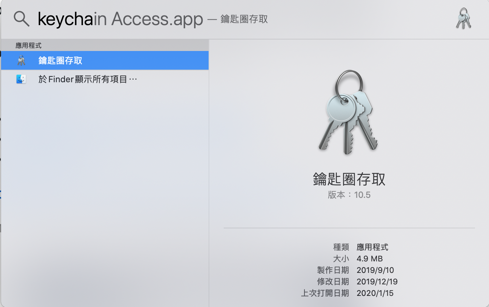
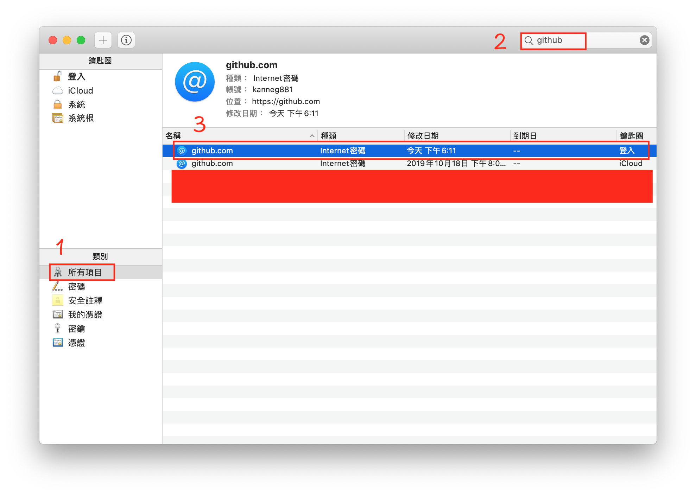
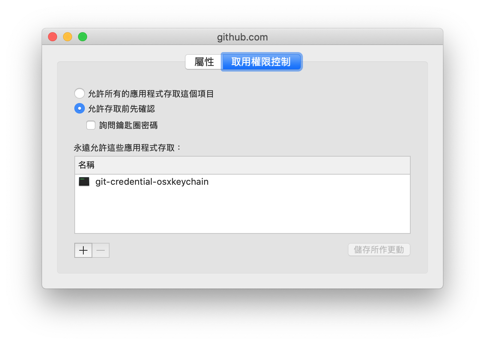

# 切換帳號

## 介紹

一開始推上遠端倉庫會要求輸入帳號密碼，例如 GitHub https 方式，之後要再推遠端倉庫就一直使用此帳號密碼，但如果想要切換帳號密碼時，必須下指令

## **憑證存儲** Credential Storage

儲存方式有好幾種

1. cahce
2. store
3. osxkeychain
4. winstore

mac 預設是使用 osxkeychain   
osxkeychain 是 mac 內建的鑰匙圈  
作者會特別說明 osxkeychain

winstore 是給 windows 用的

`git config credential.helper`  
查看使用的是哪個憑證模式

`git config --global credential.helper mode`  
設定憑證模式

```text
$ git config --global credential.helper osxkeychain
```

## 刪除 osxkeychain

按 &lt;Ctrl-space&gt; 打開 Spotlight 搜尋 Keychain Access app



在鑰匙圈搜尋 github



在取用權限控制有寫 git-credential-osxkeychain 才是 github 登入用的



接下來看是要編輯或刪除都可

### 使用終端刪除

注意 host=github.com 和 protocol=https 要手動輸入

```text
$ git credential-osxkeychain erase
host=github.com
protocol=https

按 Enter
```

