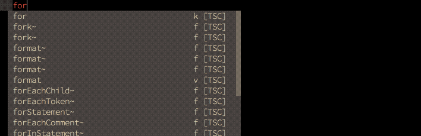

# coc-snippets

## 介紹

語法片段框架，需要另外安裝語法片段插件  
可以載入 UltiSnips 和 snipmate 和 VSCode 語法片段



## 下載



## 簡易說明

語法片段插件官網說建議安裝 [honza/vim-snippets](vim-snippets.md)  
vim-snippets 包含很多語言，讀者可以看是否有您想要的  
或者讀者可以自己尋找其他的語法片段插件

如果要自定義語法片段可以在 vim 輸入  
`:CocCommand snippets.editSnippets`  
這會在當前的檔案型態新增自定義檔案  
檔案裡面有教學如何自定義語法片段  
讀者可以自行查看檔案新增在哪  
只要看緩衝區的列表就知道了  
`:ls`  
像是在 PHP 檔輸入  
就會新增 php.snippets  
  
`:CocCommand snippets.openSnippetFiles`  
打開當前檔案類型的 snippets 檔案

如果想看中文教學，可以參考



## 配置 .vimrc

有些語法片段像是

```text
function name(type args)
{

}
```

假設使用如上的語法片段，需要修改 name, type, args 名稱  
語法片段如果有設計好的話，一開始會選取 name ，修改完後  
跳下一個選取 type，然後是 args，預設是 &lt;Ctrl-j&gt; 跳下一個  
而下面的配置就是改成 &lt;Tab&gt; 跳下一個，還有按 &lt;Tab&gt; 擴展片段  
例如輸入 f 按 &lt;Tab&gt; 就會跳出如上的程式碼



```text
" 使用 <tab> 鍵觸發自動完成、確認、擴展片段、跳躍
inoremap <silent><expr> <TAB>
      \ pumvisible() ? coc#_select_confirm() :
      \ coc#expandableOrJumpable() ? "\<C-r>=coc#rpc#request('doKeymap', ['snippets-expand-jump',''])\<CR>" :
      \ <SID>check_back_space() ? "\<TAB>" :
      \ coc#refresh()

function! s:check_back_space() abort
  let col = col('.') - 1
  return !col || getline('.')[col - 1]  =~# '\s'
endfunction

let g:coc_snippet_next = '<tab>'
```



