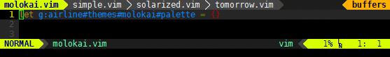

# airline

## 介紹

美觀狀態欄和標籤欄




## 下載

[https://github.com/vim-airline/vim-airline](https://github.com/vim-airline/vim-airline)

## 簡易說明

建議一併下載 airline-themes  
還有終端有一個叫 powerline 類似 airline

## 配置 .vimrc

```text
" 設定主題
" let g:airline_theme = 'violet'
" 當緩衝區修改時高亮
let g:airline_minimalist_showmod = 1
" 使用 powerline 外觀
let g:airline_powerline_fonts = 1
" 美觀標籤頁
let g:airline#extensions#tabline#enabled = 1
```

