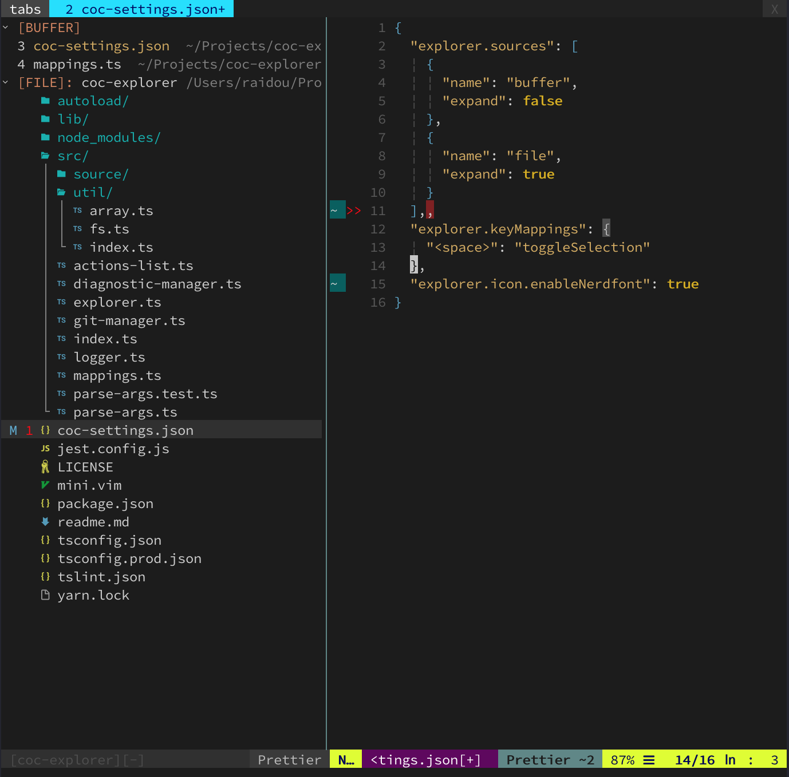

# coc-explorer

## 介紹

檔案瀏覽樹，作者在撰寫時這個插件還在開發中  
不過已經可以使用了，只是未來為大修改

需要先安裝 [coc](../dai-ma/coc.md) 插件才能使用

如果已經安裝 [NERDTree](nerdtree.md) 的讀者  
可以考慮使用 coc-explorer



下面會教導如何顯示圖標

## 下載





## 簡易說明

安裝方式到 coc-explorer 官網查看

`:CocCommand explorer`  
打開檔案瀏覽器，下面有教學配置快捷鍵

`?`  
在檔案瀏覽器輸入，會有幫助文件

## 安裝圖標

到[下載](coc-explorer.md#xia-zai)的 Nerd Fonts 安裝字體，選擇喜歡的下載就好

下面舉例安裝到 mac os 系統裡面

## 配置 .vimrc



```text
" 快捷鍵 ge 打開檔案瀏覽器
:nmap ge :CocCommand explorer<CR>
```



