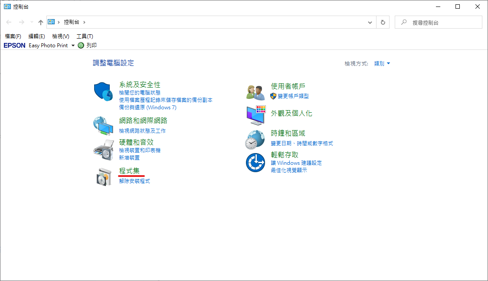

# Windows 上使用 bash

以下教大家兩種方式，如何在 Windows 使用 bash

## Git Bash

這個方法為，安裝 Git 後，在桌面或檔案夾按右鍵選擇 Git Bash Here 即可

你可以同時使用 bash 和 windows 的指令。



## Windows Subsystem for Linux

這是在 Windows 上運行 Linux 的方法，不用再安裝虛擬機了。

選擇程式集

選擇開啟或關閉 Windows 功能

打勾適用於 Linux 的 Windows 子系統

接著重新啟動系統

到 Windows 商店安裝 Ubuntu，啟動應用程式即可

你也可以在命令提示字元輸入 ubnutu 進入子系統

這個子系統的路徑大概位置如下

C:\Users\UserName\AppData\Local\Packages\CanonicalGroupLimited.UbuntuonWindows...\LocalState\rootfs

