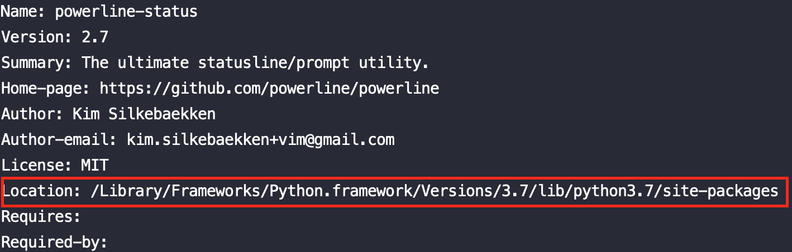
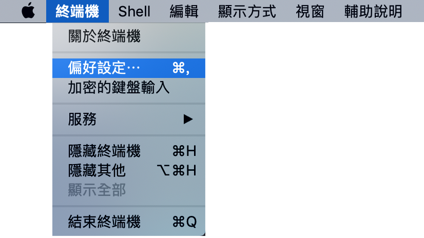
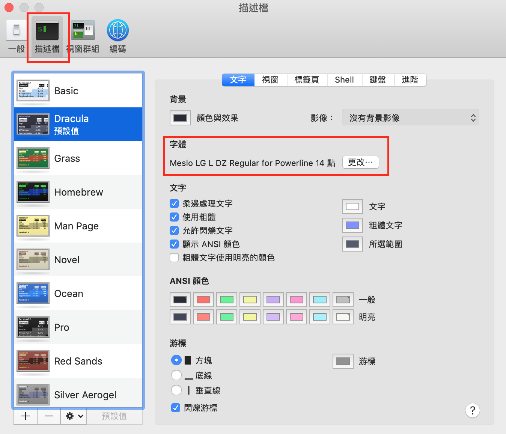

# powerline

## 介紹

讓終端提示像一條一條的標籤


## 下載

### 官網



### 詳細步驟（包含各個系統的安裝方式）



### python（使用官網下載，應該會包含 pip）



### powerline font



### powerline gitstatus



## 簡易說明

因為安裝有點複雜，作者在這裡簡單描述安裝流程  
下載的地方都放在[下載](powerline.md#xia-zai)底下

powerline font\(字體\)要安裝，基本上預設的字體會跑出?  
代表讀不到，使用 powerline 字體就可以讀到了

powerline git 則看個人需求，安裝完比較好看  
powerline 本身也有 git 提示

git 是版本控制，一般開發程式會有好幾個版本，使用版本控制可以快速切換版本，並清楚記錄每個版本修改了什麼

1. 安裝 python
2. 使用 python 的 pip 安裝 powerline-status（指令再[詳細步驟](powerline.md#xiang-xi-bu-zhou-bao-han-ge-ge-xi-tong-de-an-zhuang-fang-shi)裡面）
3. 安裝 powerline font
4. 安裝 powerline gitstatus
5. 配置 .bash\_profile（mac os），其他系統的配置檔名不一樣，請自行調整
6. 配置 powerline

#### 第 2 步驟

安裝完後在終端輸入指令查看下載的位置 Location  
在第 5 步驟配置時會用到  
$ 是模擬終端提示符號，請勿輸入

如果是安裝 python3 就是 pip3，或者是 pip3.x，  
輸入 pi 按 tab 鍵會看到有哪寫可以輸入

```text
$ pip3 show powerline-status
```

位置可能與我不同，以自己的終端顯示為主



#### 第 3 步驟

安裝完之後，需要設定字體  
只要是 for powerline 的字體都行

以 mac os 示範





基本上字體更改完就沒什麼問題  
如果整個 powerline 安裝完發現字體還有問題的話  
可以嘗試 powerline font 官網的 [Fontconfig](https://github.com/powerline/fonts#Fontconfig) 說明

## 配置環境

bash 檔案位置在  
~/.bash\_profile

zsh 檔案位置在  
~/.zshrc

示範代碼最後一個是 {Location} 的位子再往後延伸  
{Location}/powerline/bindings/{terminal}/{install\_file}  
你可能是要安裝 zsh 或 fish，所以 {terminal} 依自己安裝需求調整

以下以 bash 做示範

```text
# powerline 設定
powerline-daemon -q
POWERLINE_BASH_CONTINUATION=1
POWERLINE_BASH_SELECT=1
. /Library/Frameworks/Python.framework/Versions/3.7/lib/python3.7/site-packages/powerline/bindings/bash/powerline.sh
```

如果沒有顏色，嘗試再補上以下代碼  
LSCOLORS 自行決定要不要加入，不影響 powerline

```text
# 終端顯示顏色
export CLICOLOR=1
# 顯示檔案和資料夾相關的顏色
export LSCOLORS='gxfxcxdxcxegedabagacad'
# 終端顏色設定
export TERM=xterm-256color
```

## 配置 powerline

### 配置 theme

示範檔案位置，可以參考看我修改了什麼  
或者直接在複製我底下的設定檔到配置位置  
{Location}/powerline/config\_files/themes/shell/default.json

檔案配置位置（以 mac os 為例）  
~/config/powerline/shell/default.json

這個是終端提示顯示的內容，因為我覺得太長所以設計成兩行  
第二行才是等待使用者輸入  
above 就是第一行，裡面還有 left right 都屬於第一行  
above 外面的 left right 就是第二行  
left 為顯示在左側  
right 為顯示在右側  
因為我沒用 right 所以就空空的  
powerline\_gitstatus.gitstatus 是安裝 git status 需要設定的  
其他詳細設定可以參考[詳細步驟](powerline.md#xiang-xi-bu-zhou-bao-han-ge-ge-xi-tong-de-an-zhuang-fang-shi)裡面的說明

```text
{
    "segments": {
        "above": [
            {
                "left": [
                    {
                        "function": "powerline.segments.shell.mode"
                    },
                    {
                        "function": "powerline.segments.common.net.hostname",
                        "priority": 10
                    },
                    {
                        "function": "powerline.segments.common.env.virtualenv",
                        "priority": 50
                    },
                    {
                        "function": "powerline.segments.shell.cwd",
                        "args":
                        {
                            "dir_shorten_len": 3,
                            "dir_limit_depth": 3
                        },
                        "priority": 10
                    },
                    {
                        "function": "powerline.segments.shell.jobnum",
                        "priority": 20
                    },
                    {
                        "function": "powerline_gitstatus.gitstatus",
                        "priority": 40
                    }
                ],
                "right": [
                ]
            }
        ],
        "left": [
            {
                "function": "powerline.segments.common.env.user",
                "priority": 30
            }
        ],
        "right": [
        ]
    }
}

```

## 配置 colorscheme

示範檔位置  
{Location}/powerline/config\_files/colorschemes/default.json

檔案配置位置  
~.config/powerline/colorschemes/default.json

我只有新增 gitstatus 配置，其他都是預設值

```text
{
    "name": "Default color scheme for shell prompts",
    "groups": {
        "hostname":         { "fg": "brightyellow", "bg": "mediumorange", "attrs": [] },
        "environment":      { "fg": "white", "bg": "darkestgreen", "attrs": [] },
        "mode":             { "fg": "darkestgreen", "bg": "brightgreen", "attrs": ["bold"] },
        "attached_clients": { "fg": "white", "bg": "darkestgreen", "attrs": [] },
        "gitstatus":                 { "fg": "gray8",           "bg": "gray2", "attrs": [] },
        "gitstatus_branch":          { "fg": "gray8",           "bg": "gray2", "attrs": [] },
        "gitstatus_branch_clean":    { "fg": "green",           "bg": "gray2", "attrs": [] },
        "gitstatus_branch_dirty":    { "fg": "gray8",           "bg": "gray2", "attrs": [] },
        "gitstatus_branch_detached": { "fg": "mediumpurple",    "bg": "gray2", "attrs": [] },
        "gitstatus_tag":             { "fg": "darkcyan",        "bg": "gray2", "attrs": [] },
        "gitstatus_behind":          { "fg": "gray10",          "bg": "gray2", "attrs": [] },
        "gitstatus_ahead":           { "fg": "gray10",          "bg": "gray2", "attrs": [] },
        "gitstatus_staged":          { "fg": "green",           "bg": "gray2", "attrs": [] },
        "gitstatus_unmerged":        { "fg": "brightred",       "bg": "gray2", "attrs": [] },
        "gitstatus_changed":         { "fg": "mediumorange",    "bg": "gray2", "attrs": [] },
        "gitstatus_untracked":       { "fg": "brightestorange", "bg": "gray2", "attrs": [] },
        "gitstatus_stashed":         { "fg": "darkblue",        "bg": "gray2", "attrs": [] },
        "gitstatus:divider":         { "fg": "gray8",           "bg": "gray2", "attrs": [] }
    },
    "mode_translations": {
        "vicmd": {
            "groups": {
                "mode": {"fg": "darkestcyan", "bg": "white", "attrs": ["bold"]}
            }
        }
    }
}
```

