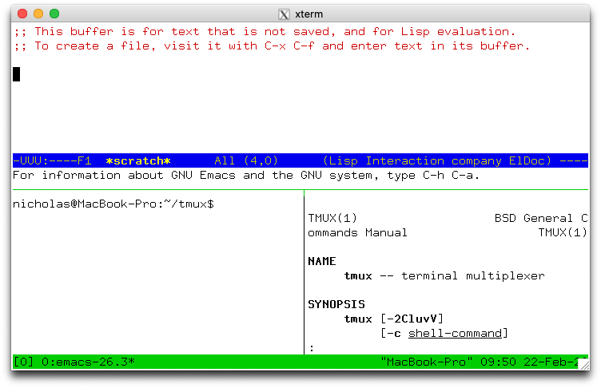
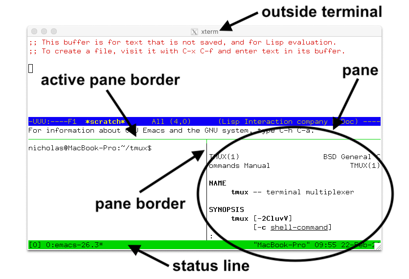
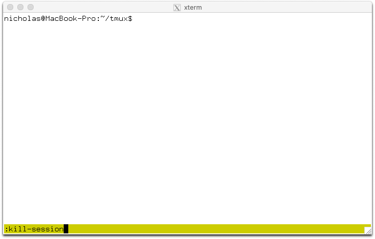

# tmux

## 介紹

tmux 為 Terminal Multiplexer 終端多工器簡稱，讓終端可以分割的插件，一般終端都是用標籤頁做切換，但沒辦法同時出現兩個終端在同一個標籤頁上，這個插件可以辦到。



## 下載



## 安裝

安裝前先確定目前的系統是可以運作這個插件的  
OpenBSD, FreeBSD, NetBSD, Linux, OS X 和 Solaris

一般照上面官網的安裝方式有點複雜，作者在 Mac OS 沒有安裝成功，它依賴的套件有點不太清楚如何安裝，大家再自行研究。

Mac OS 上可以使用 brew 安裝，比較簡單，如下所示

```text
$ brew search tmux 
$ brew install tmux
```

安裝完，測試看看有沒有安裝成功

`$ tmux -V`  
查看 tmux 版本

## 說明

這邊簡要說明，詳細說明可以到[下載](tmux.md#xia-zai)頁面查看

以下用中文代稱  
pane 窗格  
window 窗口  
sessison 會話

下圖有三個窗格，其中一個窗格 active pane 為運作中的窗格，可以下指令的窗格，每個窗格用線區隔，運作中的窗格線為綠色，這三個窗格在一個窗口中，下圖顯示的窗口稱為當前的窗口，所以可能會有其它的窗口，一個會話存在多個窗口，會話可以有多個，所以下圖為目前會話中當前窗口的三個窗格，最下面綠色的是狀態欄



* 程序在終端的窗格中運行，每個窗格都對應一個窗口
* 每個窗口都有一個名稱和一個運作的窗格
* 窗口連接到一個或多個會話
* 每個會話都有一個窗口列表，每個窗口都有一個索引。
* 顯示在會話中的窗口，為當前窗口
* 會話連接零到多個客戶端
* 每個客戶端連接到一個會話

### 狀態欄


\[0\] 會話名稱

0:man ~ 3:bash 窗口索引:窗口名稱  
太多窗口會以 &lt; 和 &gt; 代表箭頭後面還有的意思  
- 符號為上一個窗口  
\* 符號為當前窗口

"MacBook-Pro" 窗格名稱

10:33 22-Feb-20 時間

### 命令提示

`C-b :`  
切換命令提示，狀態欄會變成冒號 :



多個指令，可以用分號 ; 區隔

## 常用指令

### 建立會話

`$ tmux`  
一開始沒有會話時可以不帶參數

`$ tmux new-session`  
建立會話，名稱為按照數字順序  
new-session 縮寫為 new

`$ tmux new -smysession`  
建立會話，名稱為 mysession  
-s 指定會話名稱

`$ tmux new -d`  
建立會話  
-d 隱藏在背景

`$ tmux new -nmytopwindow top`  
建立會話，一開始的窗口名稱為 mytopwindow，運作 top 指令  
-n 指定一開始的窗口名稱

### 連接會話

`$ tmux attach`  
連接最近使用的會話，並且尚未連接的

`$ tmux attach -tmysession`  
連接指定會話名稱的會話  
-t 指定會話

`$ tmux attach -dtmysession`  
連接指定會話名稱的會話  
並且分離其他已經連接此會話的用戶  
注意這裡是 -dt\[會話名稱\]  
-d 分離其他已經連接此會話的用戶

`$ tmux new -Asmysession`  
建立會話，如果會話名稱存在就連接此會話  
注意這裡是 -As\[會話名稱\]  
-A 如果會話名稱存在就連接此會話  
-D 類似 attach -d ，分離其他已經連接此會話的用戶

### 列出會話

`$ tmux list-session`  
顯示可以連接的可用會話列表  
list-session 縮寫為 ls

## 進入到 tmux 的快捷鍵

C-b 代表 Ctrl-b

C- Ctrl  
M- 通常是 Alt  
S- shift

如果組合在一起 C-M-x 代表 Ctrl-Alt-x

`C-b ?`  
列出按鍵綁定

`C-b :`  
切換命令提示，狀態欄會變成冒號 :

`C-b %`  
新增窗格，水平分割，左右各一個

`C-b "`  
新增窗格，垂直分割，上下各一個

`C-b c`  
新建窗口  
窗口索引按照 0 1 2 依序指定  
中間有空缺會優先填滿

`C-b d`  
分離會話，類似斷線  
會提示 \[detached \(from session sessionName\)\]

### 改變當前窗口

`C-b number`  
改變窗口為 number，number 為 0 ~ 9

`C-b '`  
狀態欄出現提示 index 後面輸入窗口索引，並切換到此窗口

`C-b n`  
切換到下一個數字索引窗口，如果存在的話

`C-b p`  
切換到上一個數字索引窗口，如果存在的話

`C-b l`  
切換到前一個當前窗口

**改變活動窗格**

`C-b Up`, `C-b Down`, `C-b Left` 和 ****`C-b Right`  
****使用上下左右的方式改變

`C-b q`  
使用此指令會跳出窗格號碼，  
在號碼還沒消失前輸入對應的號碼  
就能改變活動窗格為此號碼

`C-b o`  
移動到下一號的窗格

`C-b C-o`  
移動下一號的窗格到目前窗格的位置


\*\*\*\*

## 進入到 tmux 指令

`$ tmux split-window -flag`  
分割窗口，可以搭配 flag  
-b 分割的窗口在左邊或上面  
-d 分割後不切換當前輸入指令的窗口  
-f 分割的窗口佔整個寬或高  
-h 水平分割，預設為右邊  
-v 垂直分割，預設為下面  
以上的參數同樣適用`new-session` 和 `new-window`

`$ tmux display-panes`  
顯示窗格號碼

`$ tmux select-pane -t[number]`  
選擇活動窗格為 number  
number 為數字，用 `$ tmux display-panes`  查看

## 命令提示指令

`:kill-server`  
殺死會話\(刪掉的意思\)

`:neww command`  
新增一個視窗，並下 command 指令

`:neww -dnmynewwindow`  
新增一個視窗名為 mynewwindow，並且不進入此視窗  
不讓此視窗為當前視窗  
注意這裡為 -dn\[視窗名稱\]  
-d 不進入此視窗  
-n 命名視窗

`:neww -t999`  
新增一個視窗，索引值為 999  
-t 指定索引值

