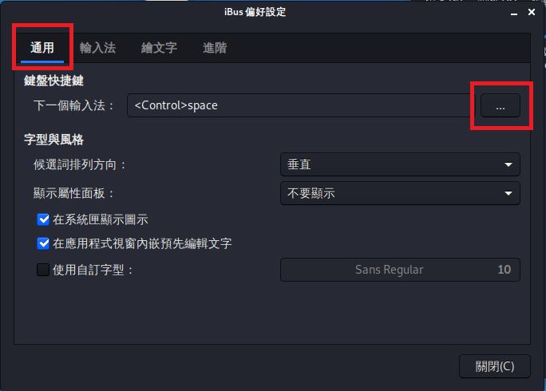

# 中文亂碼和中文輸入

## 中文字體

如果剛安裝完 Kali 系統中文亂碼的話，可能是要安裝中文字體

這時先登入，然後打開終端機安裝套件

`$ apt-get install fonts-wqy-zenhei`

如果無法解決的話可能要自行尋找其他問題了

## 中文輸入

先安裝中文輸入套件

`$ apt-get install ibus ibus-pinyin ibus-chewing`

### 配置中文輸入法

### 修改快捷鍵

在台灣比較常用的是 &lt;Ctrl-space&gt;，以下為修改成 &lt;Ctrl-space&gt;

