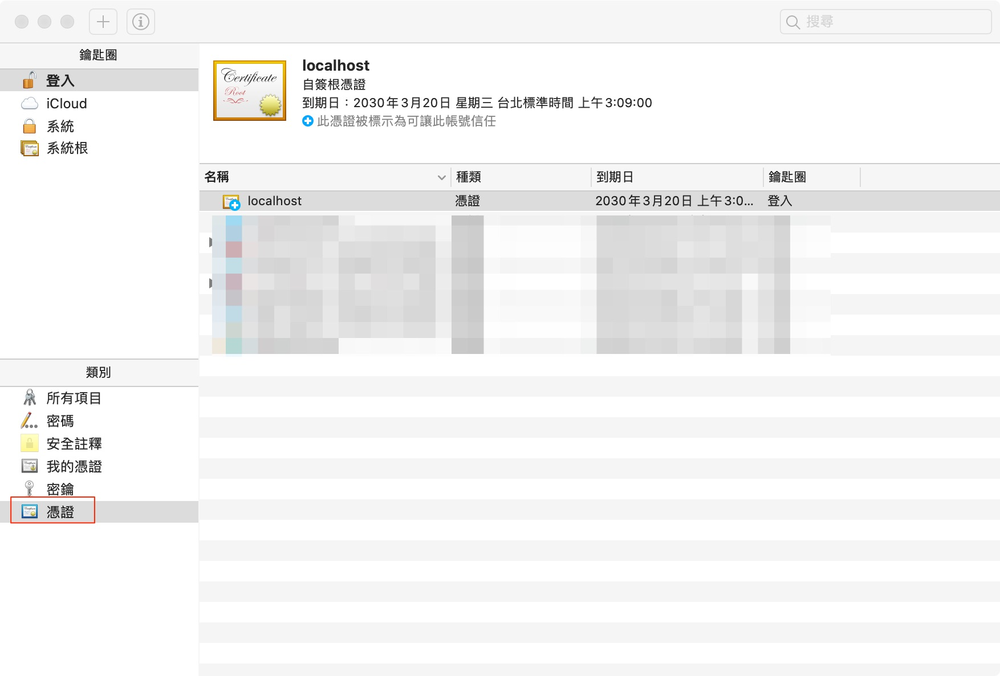

# localhost https

## 介紹

http 和 https 的差別在於，後者是安全的傳輸協定  
本篇介紹如何在本機端使用 https

## 設定

要使用 https 總共有三個步驟

1. 設定伺服器 \(例如 Apache\)
2. 建立憑證
3. 信任憑證

### 設定伺服器

將 /usr/local/etc/httpd/httpd.conf 的一些註解 \# 移除掉  
如下所示


```text
LoadModule socache_shmcb_module lib/httpd/modules/mod_socache_shmcb.so
LoadModule ssl_module lib/httpd/modules/mod_ssl.so
Include /usr/local/etc/httpd/extra/httpd-ssl.conf
```


將 /usr/local/etc/httpd/extra/httpd-ssl.conf   
監聽埠號 Listen 8443 改成 Listen 443


```text
Listen 443
```


將 /usr/local/etc/httpd/extra/httpd-ssl.conf  
&lt;VirtualHost _default_\_:8443&gt;  
和下面的 ServerName www.example.com:8443  
8443 改成 443  
並將 &lt;VirtualHost _default_\_:8443&gt;  
下面的這兩行程式碼註解  
DocumentRoot "/usr/local/var/www"  
ServerName www.example.com:8443


```text
<VirtualHost _default_:443>

#   General setup for the virtual host
#DocumentRoot "/usr/local/var/www"
#ServerName www.example.com:443
```


到 /usr/local/etc/httpd/extra/httpd-vhosts.conf  
建立一個 virtual host


```text
<VirtualHost *:443>
    DocumentRoot "/Users/yourName/www"
    ServerName localhost
    SSLEngine on
    SSLCertificateFile "/usr/local/etc/httpd/server.crt"
    SSLCertificateKeyFile "/usr/local/etc/httpd/server.key"
</VirtualHost>
```


DocumentRoot 網站檔案的目錄  
ServerName 伺服器名稱  
SSLCertificateFile 憑證的檔案位置  
SSLCertificateKeyFile 憑證鑰匙的檔案位置

### 建立憑證

在 /usr/local/etc/httpd 資料夾底下  
建立憑證設定檔 ssl.conf


```text
[req]
prompt = no
default_md = sha256
default_bits = 2048
distinguished_name = dn
x509_extensions = v3_req

[dn]
C = TW
ST = Taiwan
L = Taipei
O = YourCompany Inc.
OU = IT Department
emailAddress = example@example.com
CN = localhost

[v3_req]
subjectAltName = @alt_names

[alt_names]
DNS.1 = localhost
DNS.2 = 127.0.0.1
```


\[dn\] 為憑證的相關資訊  
C 國家名稱  
ST 州或省名稱  
L 地區名稱  
O 機構名稱\(公司名稱\)  
OU 組織單位名稱\(公司部門\)  
emailAddress 電子郵件  
CN 通用名\(伺服器名稱\)

上面建立 VirtualHost 的 ServerName 為 localhost  
所以 CN 設為 localhost

\[alt\_names\] 為域名  
可以視你的需求多設定幾個  
目前需要的是本機端，所以設定 localhost 和 127.0.0.1

因為上面設定 SSLCertificateFile 位置在  
 /usr/local/etc/httpd 資料夾底下  
所要先切換到指定資料夾再建立憑證

`$ cd /usr/local/etc/httpd  
$ openssl req -x509 -new -nodes -sha256 -utf8 -days 3650 -newkey rsa:2048 -keyout server.key -out server.crt -config ssl.conf`

建立好之後測試看看，有沒有問題

`$ sudo apachectl configtest`

沒有問題的話就重啟伺服器

`$ sudo apachectl -k restart`

重啟之後可以看 /usr/local/var/log/httpd/error\_log 有沒有錯誤訊息

### 信任憑證

以下是 mac 信任憑證的方法




接下來會看到 localhost 憑證，並將它打開


接下來就能使用 https://localhost 了

## 參考







