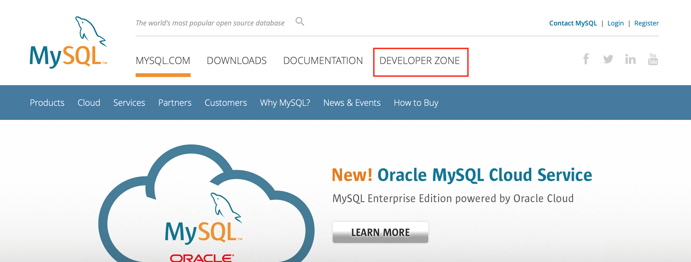
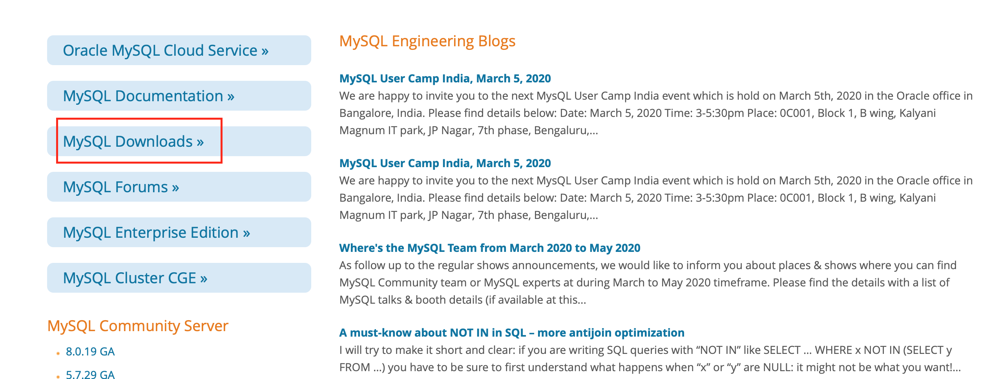
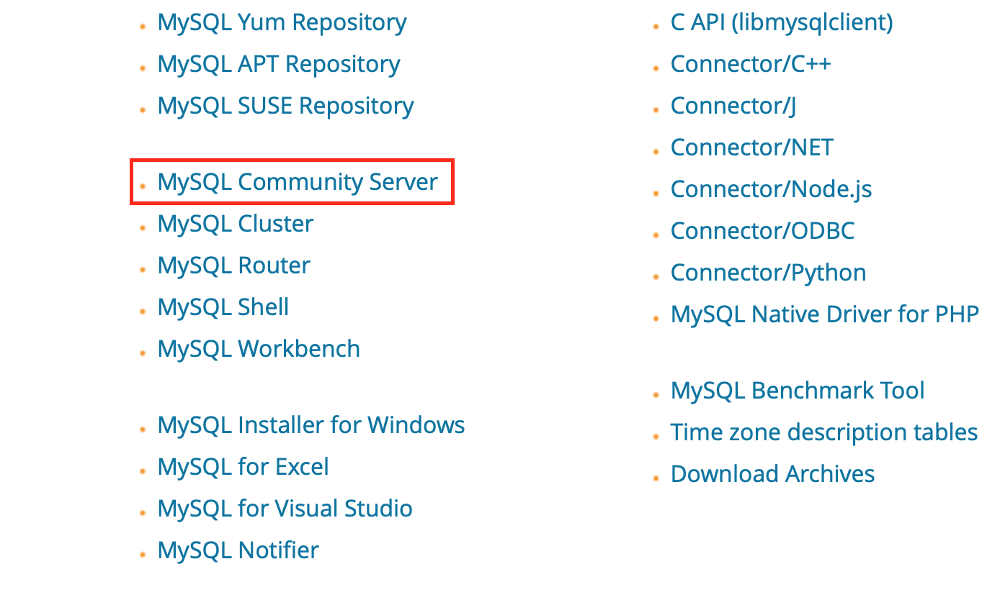
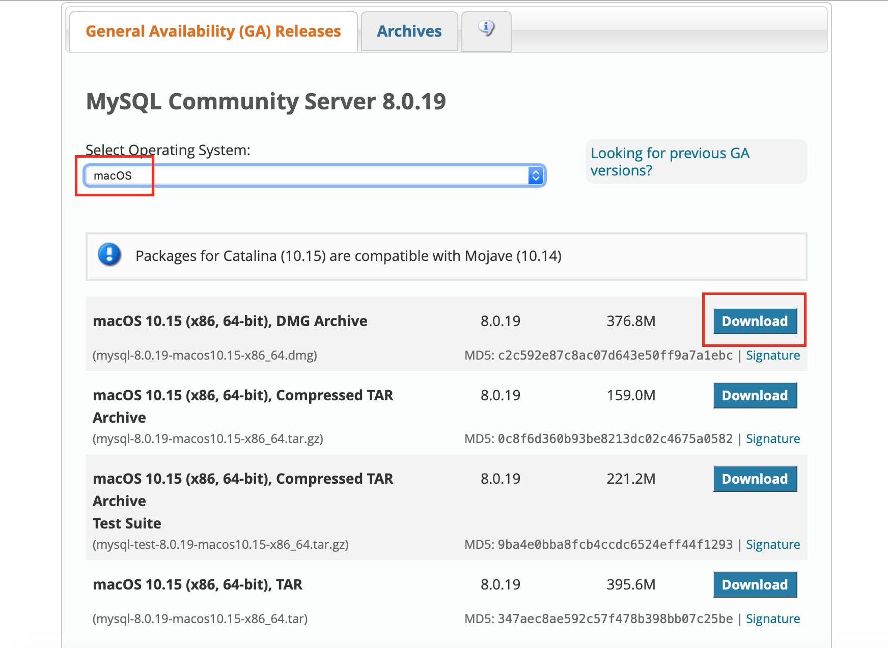
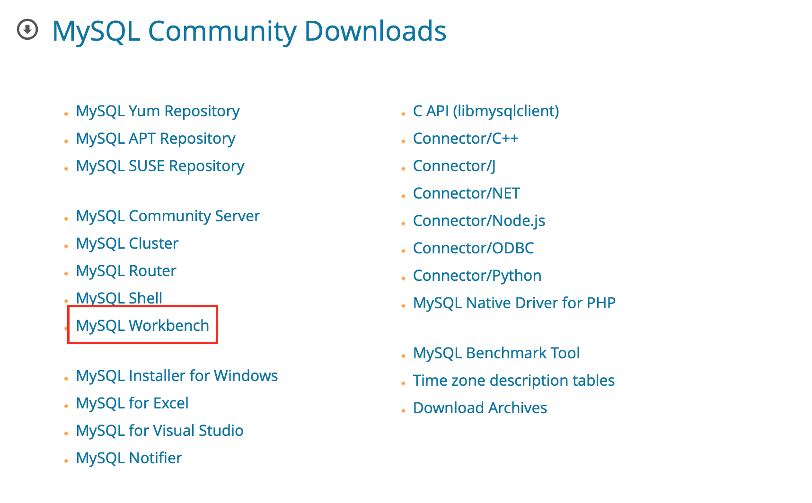
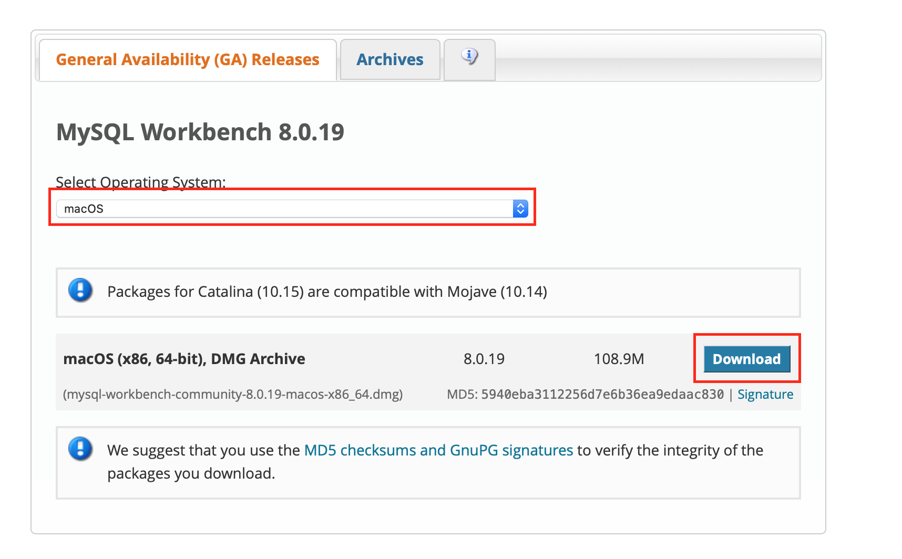

# MySQL

## 說明

MySQL 是資料庫，用來儲存資料

## 安裝

### 安裝 MySQL



到官網安裝

下載完，按照步驟安裝即可，請記住設定的密碼  
後續登入 MySQL 要登入用

打開 左上表蘋果Logo &gt; 打開系統偏好設定 &gt; MySQL   
看是否有亮綠燈，代表啟動  
沒有的話請啟動它

### 安裝 GUI

如果不想打指令，可以使用 MySQL Workbench  
有圖形介面

安裝完打開即可使用

或者可以使用 [phpMyAdmin](phpmyadmin.md)

